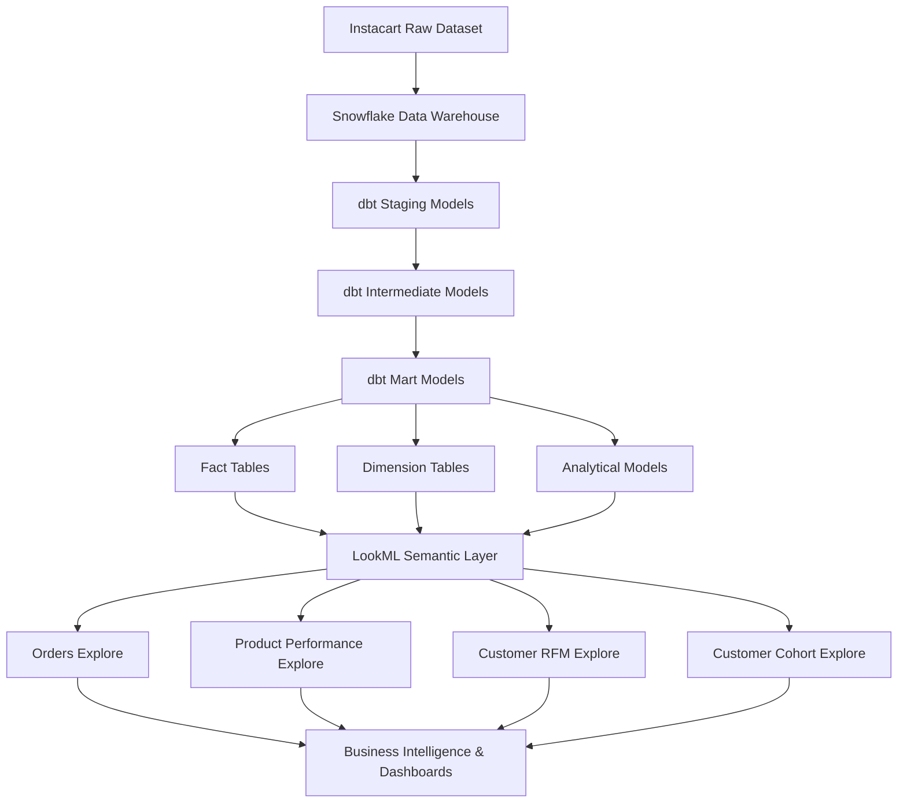

# Instacart Analytics Engineering Project

This repository demonstrates an end-to-end analytics engineering workflow built on the Instacart dataset.

The project models order, product, and customer analytics using a modern analytics stack consisting of:

* Snowflake (data warehouse)
* dbt (data transformation and data modeling)
* LookML (semantic layer for business analytics)

The goal of the project is to design a scalable analytics warehouse and semantic layer that supports business intelligence use cases such as revenue analysis, customer retention, and product performance.

---


## Architecture Overview

## Architecture Overview



## Project Structure

```
instacart-analytics-dbt-looker
│
├── dbt/
│   Data warehouse transformations and analytics marts
│
├── lookml/
│   LookML semantic layer with reusable explores and metrics
│
└── README.md
```

---

## Key Analytics Models

### Fact Tables

* fact_orders
* fact_order_items

### Dimension Tables

* dim_customer
* dim_product
* dim_date

### Analytical Marts

* product_performance
* customer_rfm
* customer_cohorts

---

## Example Business Questions

Revenue Analytics

* What is the average order value by month?
* Which products generate the highest revenue?

Customer Analytics

* Which customers have the highest lifetime value?
* Which customers are likely to churn?

Retention Analysis

* What percentage of customers return after their first order?
* How do retention cohorts behave over time?

Product Analytics

* Which products drive the highest margin?
* What products have the highest reorder rate?

---

## Technologies Used

* dbt
* Snowflake
* LookML
* SQL
